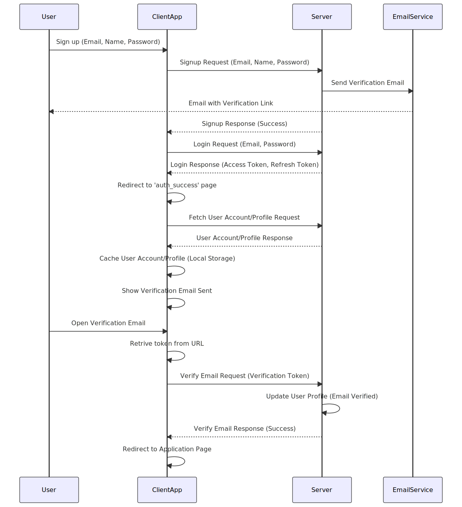
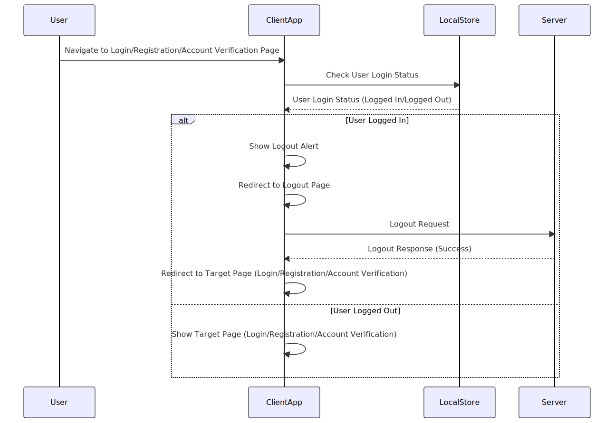

## Sign-up Process

The following diagram explains the signup process in general.

The flow starts from the `/accounts/registration` link and you can read the codebase from here and understand the flow.

## UI Flow

The following diagram shows the client-side (React APP) UI flow in the process.

## Logout guard flow

The following diagram shows the client side (React APP) logout guard flow in the application.

